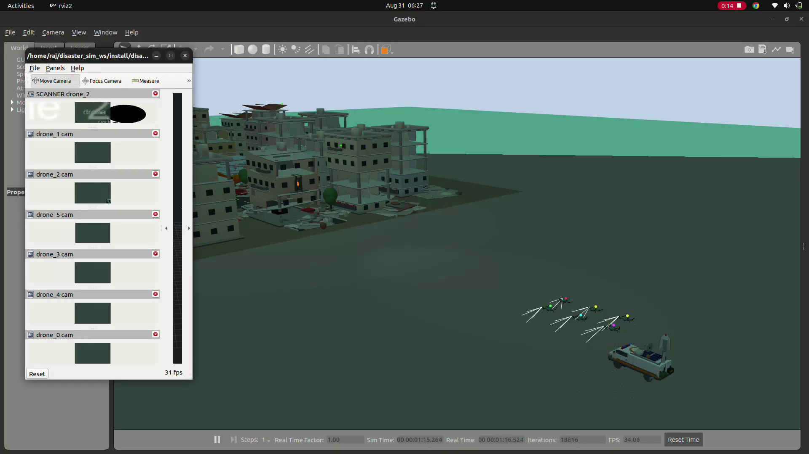

# Disaster Drone Swarm

A ROS 2 + Gazebo simulation of a six drone search and rescue swarm responding to an earthquake damaged building. Built and tested on Ubuntu 22.04, ROS 2 Humble, and Gazebo Classic (Gazebo 11).



## What it does

Six camera drones take off from a 5G command van, fan out toward a damaged building, and one of them (the "scanner") flies a scan pattern along the building's east facade. Its camera feed runs an OpenCV color detector, and when it picks up the trapped victim it publishes an alert on `/base_station/alerts` with the victim's position and which drone found them. RViz shows all six camera feeds, the drone markers, and the alert marker live while the mission runs.

This isn't meant to be a new perception algorithm or a flight controller. The drone motion is purely kinematic (no PX4, no physics based flight), and detection is a simple orange contour check gated to the scan phase. Think of it as a visualization layer sitting on top of an already decided mission plan, useful for demoing swarm behavior and the alerting pipeline without needing a full flight stack.

## Running it

```bash
cd ~/disaster_sim_ws
colcon build --packages-select disaster_sim
source install/setup.bash
ros2 launch disaster_sim mission.launch.py
```

That one launch file brings up Gazebo with the world, spawns all six drones, and starts the swarm controller, RViz2, and the mission node together. When the mission finishes it shuts everything down on its own.

Launch args:

| arg | default | what it does |
|---|---|---|
| `gui:=false` | `true` | run Gazebo headless (no gzclient window) |
| `rviz:=false` | `true` | skip RViz2 |
| `world_wait:=N` | `35` | seconds to wait for the world to finish loading before spawning drones, bump this up on a slower machine |

The city world is a fairly heavy mesh (over 4000 primitives baked down into one), so the first load can take 30 to 40 seconds. Watch the terminal, it prints each mission phase and an `>>> ALERT` banner once the victim is found.

## Layout

- `worlds/disaster_city.world`, the city, the damaged building, the 5G van, the victim, and lighting
- `models/`, disaster_city, damaged_building, fiveg_base_station, sar_drone (the drone mesh), and victim
- `description/drone.sdf.template`, per drone SDF with the camera plugin and an id marker, filled in at launch
- `nodes/swarm_controller.py`, kinematic hover controller, takes cmd_pose and pushes it into Gazebo
- `nodes/mission_node.py`, the scripted mission logic plus the OpenCV detection and alerting
- `rviz/mission.rviz`, saved RViz layout with the 6 camera feeds, TF, swarm markers, and the alert marker
- `launch/mission.launch.py`, the single launch file that ties it all together
- `tools/`, the build and headless test scripts used while developing this

## Assets

The world and building models started out as primitive only URDFs and got converted to Collada meshes (one mesh per color) with `tools/urdf_to_merged_dae.py`, mainly to cut draw calls down so six offscreen cameras can still run in real time. The drone mesh went through a similar USD to Collada conversion. The building facade has a window carved into it so the victim is only visible from one approach angle, which is what makes the scan pattern actually matter.

## Known issues

- Gazebo Classic throws a `terminate ... std::runtime_error` on shutdown. It's a known teardown race in gazebo_ros on Humble and is harmless.
- Gazebo Classic's `<actor>` (a skinned human mesh) hangs the world load in this setup, so the victim is an articulated box figure in a hi-vis jacket instead of an actual human model. Still recognizable, and gives the detector an honest orange target.
- The 6 RViz image panels are all tabbed together with no saved tiling, drag them apart if you want to see all feeds at once.
- Detection happens about 6 seconds into the scan since the drones move at 7 m/s. If you want a longer sweep for a demo video, slow the scanner down in `nodes/mission_node.py` (look at `SCAN_PATH` and the controller's `max_speed`).

## License

MIT
